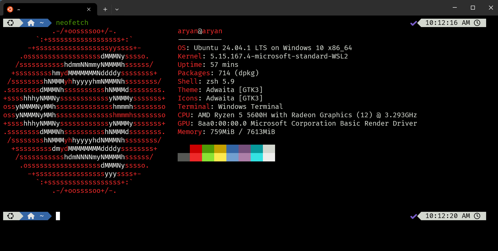

# Zsh Setup with Powerlevel10k and Plugins


This guide helps you replicate the Zsh terminal setup with Powerlevel10k theme and useful plugins.

## Prerequisites

Before starting, ensure you have the following installed:

- **Zsh**: Install Zsh using:

    ```bash
    sudo apt install zsh
    ```

- **Oh My Zsh**: Install Oh My Zsh using:

    ```bash
    sh -c "$(curl -fsSL https://raw.githubusercontent.com/ohmyzsh/ohmyzsh/master/tools/install.sh)"
    ```

- **Powerlevel10k Theme**: Install the Powerlevel10k theme by running:

    ```bash
    git clone --depth=1 https://github.com/romkatv/powerlevel10k.git $ZSH_CUSTOM/themes/powerlevel10k
    ```

- **Fonts**: Install necessary fonts for the prompt to render correctly:

    ```bash
    sudo apt-get install fonts-powerline
    ```

- **Plugins**: Install plugins for **zsh-autosuggestions** and **zsh-syntax-highlighting**:

    ```bash
    git clone https://github.com/zsh-users/zsh-autosuggestions ${ZSH_CUSTOM:-~/.oh-my-zsh/custom}/plugins/zsh-autosuggestions
    git clone https://github.com/zsh-users/zsh-syntax-highlighting.git ${ZSH_CUSTOM:-~/.oh-my-zsh/custom}/plugins/zsh-syntax-highlighting
    ```

## Setting Up `.zshrc`

1. **Backup Existing `.zshrc`**  
   Before making any changes, back up the existing `.zshrc` file:

    ```bash
    cp ~/.zshrc ~/.zshrc.backup
    ```

2. **Copy `.zshrc` Configuration**  
   Copy the configuration below into your `.zshrc` file:

    ```bash
    # Powerlevel10k instant prompt
    if [[ -r "${XDG_CACHE_HOME:-$HOME/.cache}/p10k-instant-prompt-${(%):-%n}.zsh" ]]; then
      source "${XDG_CACHE_HOME:-$HOME/.cache}/p10k-instant-prompt-${(%):-%n}.zsh"
    fi

    # Set Zsh theme to Powerlevel10k
    export ZSH="$HOME/.oh-my-zsh"
    ZSH_THEME="powerlevel10k/powerlevel10k"

    # Plugins to load
    plugins=(git zsh-autosuggestions)
    source $ZSH/oh-my-zsh.sh

    # Load Powerlevel10k prompt configuration if exists
    [[ ! -f ~/.p10k.zsh ]] || source ~/.p10k.zsh

    # NVM setup
    export NVM_DIR="$HOME/.nvm"
    [ -s "$NVM_DIR/nvm.sh" ] && \. "$NVM_DIR/nvm.sh"
    [ -s "$NVM_DIR/bash_completion" ] && \. "$NVM_DIR/bash_completion"
    ```

3. **Enable Plugins and Theme**  
   Ensure that **zsh-autosuggestions** and **zsh-syntax-highlighting** are listed in the plugins section of the `.zshrc`.

4. **Apply Changes**  
   After updating the `.zshrc`, restart the terminal or run:

    ```bash
    source ~/.zshrc
    ```

## Conclusion

With these steps, your terminal will be set up with **Powerlevel10k** theme, the **zsh-autosuggestions** and **zsh-syntax-highlighting** plugins, and **NVM** support for managing Node versions.

## If fonts are not coming try 
```bash
fc-cache -fv
```


